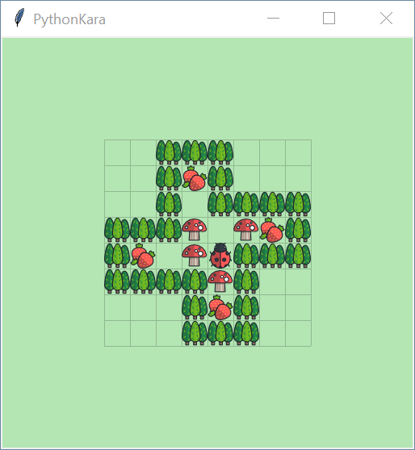

# PythonKara



PythonKara aims to teach students fundamental ideas of programming.

Kara is like [Sokoban](https://en.wikipedia.org/wiki/Sokoban). It is very popular in [German speaking countries](https://de.wikipedia.org/wiki/Kara_(Programmierumgebung)) to teach students how to program. PythonKara reimplements [PythonKara from swisseduc.ch](https://www.swisseduc.ch/informatik/karatojava/pythonkara/index.html). 

In contrast to the original PythonKara itself is written in Python and is under Mozilla Public License 2.0.


## Download

Just grab this repo and you are ready to go.


## How to use

### Create an task 

Place new file (e.g. `task01.py`) in this folder:

```python
from levels import * # load levels
TIME_S = 0.5 # set seed

current_level = 1 # set actual level

exec(open("kara.py").read()) # start

# Sensoren: onBerry(), treeFront(), treeLeft(), treeRight(), mushroomFront()
# Aktoren: move(), turnLeft(), turnRight(), putBerry(), removeBerry()

# <task description>

move() # or kara.move()
putBerry() # alias for putLeaf()
```

Syntax for creating a level is compatible to [GreenfootKara](https://github.com/marcojakob/greenfoot-kara) and [Pgame Zero Simple Game Tutorials](https://simplegametutorials.github.io/pygamezero/sokoban/).

To test your task you may change `from levels import` to `from tests import` to get an similar szenario.

### Play

[Install Pygame Zero](https://pygame-zero.readthedocs.io/en/stable/installation.html) and run `sokoban.py`. You may change  `GAME_MODE` to `kara ` (press right to turn) or `sokoban` (press right to move right). 

### Teach

I am still learning how to teach Python. 

Actual order of tasks: 1-6, 15, 18, 16, 07, 17, 8, 19, 10-13, 20-22

## Contributing

I would love to see PythonKara in action! Please release your exercises with PythonKara to help other teachers to make there lessons also great. :smile:

Thank you for considering contributing to the PythonKara ! Create a pull request or contact [me](https://wi-wissen.de/contact.php).


## Licence

PythonKara is licenced under Mozilla Public License 2.0. Just name me on the same page and link to this page or [wi-wissen.de](https://wi-wissen.de/). On printed works you have to name me with my realname like other authors or contributors. If you made changes to PythonKara you have to provide the source code.

Initial idea and movement handling is based on [Pgame Zero Simple Game Tutorials](https://simplegametutorials.github.io/pygamezero/sokoban/).

Icons are designed by very talented people from Freepik ([flaticon.com](https://support.flaticon.com/hc/en-us/articles/207248209)). Please respect there copyright.